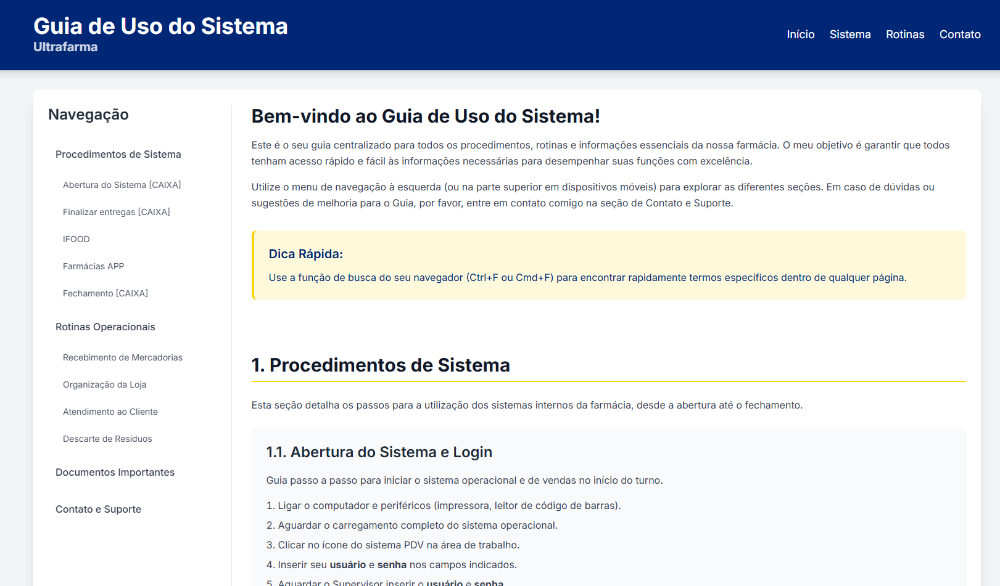
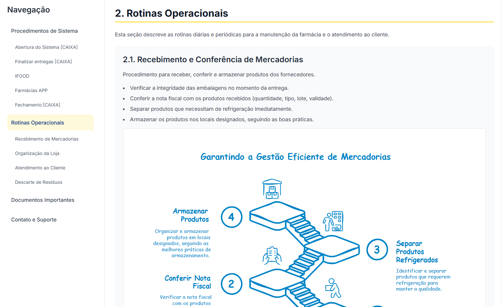

<h1 align="center"> Guia de Uso do Sistema - Ultrafarma </h1>

## 🎯 Objetivo do Projeto

Este projeto foi desenvolvido como um guia centralizado para todos os procedimentos, rotinas e informações essenciais da farmácia Ultrafarma.  
O principal objetivo é garantir que todos os colaboradores tenham acesso rápido e fácil às informações necessárias para desempenhar suas funções com excelência e eficiência.  
O guia é destinado ao uso interno da equipe Ultrafarma.

  Criado por <a href="https://instagram.com/luiz_001211" target="_blank">Aster</a>.

## 📸 Telas do Guia

  
   
  <em>Exemplo de como a tela principal do guia se parece.</em>

  
   
  <em>Exemplo de uma seção interna com o menu lateral destacando o item ativo.</em>

## 💻 Tecnologias Utilizadas

- **HTML5**: Estrutura semântica do conteúdo do guia.
- **CSS3**: Estilização e design responsivo.
  - **Tailwind CSS**: Framework CSS utilizado para agilizar a estilização e componentização.
  - **Google Fonts (Inter)**: Para a tipografia do projeto.
- **JavaScript (Vanilla JS)**:
  - Implementação da funcionalidade de "scrollspy" para destacar o item ativo no menu lateral conforme a rolagem da página.
  - Navegação suave ao clicar nos links do menu.
- **Git e Github**: Para controle de versão e hospedagem do projeto (assumindo que está ou estará em um repositório).

## 🧐 Comentários Relevantes

Este guia foi elaborado pensando na praticidade e na necessidade de padronizar e facilitar o acesso aos procedimentos operacionais e de sistema da farmácia. A intenção é que ele seja uma ferramenta viva, atualizada conforme necessário para refletir as melhores práticas e quaisquer mudanças nos processos.

**Próximos Passos (Sugestões):**

- Adicionar mais fluxogramas interativos.
- Integrar uma funcionalidade de busca interna no guia.
- Expandir as seções com mais detalhes ou novos procedimentos.
